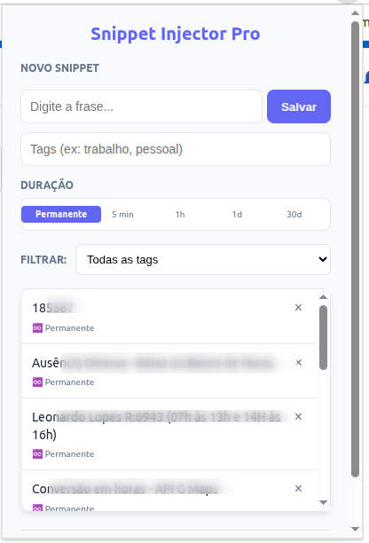
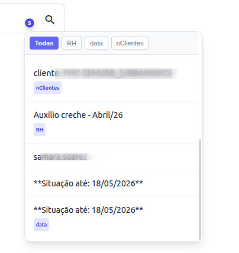

# Snippet Injector Pro 🚀

Uma extensão poderosa para navegadores baseados em Chromium (Chrome, Opera, Edge) projetada para gerenciar, organizar e injetar snippets de texto em qualquer campo de formulário da web, além de oferecer ferramentas de produtividade visual.

## ✨ Funcionalidades Principais

- **Injeção Inteligente**: Um botão flutuante "S" aparece discretamente ao lado de campos de texto. Clique para abrir um menu e inserir seus snippets instantaneamente.
- **Duração e Expiração (TTL)**: Configure snippets temporários (5 min, 1h, 1d, 30d) que se auto-excluem após o tempo determinado.
- **Categorização por Tags**: Organize seus snippets com tags e utilize filtros rápidos tanto no popup quanto no menu injetado nas páginas.
- **Importação/Exportação**: Faça backup dos seus dados ou transfira-os entre navegadores através de arquivos JSON.
- **Assistente de Ponto (Timesheet)**: Identifica automaticamente dias com falta de horas em sistemas de ponto compatíveis, exibindo um alerta visual com o tempo exato que falta para completar a jornada.
- **Design Moderno**: Interface limpa, responsiva e com suporte a micro-animações para uma experiência premium.

## 🛠️ Tecnologias Utilizadas

- **Manifest V3**: A versão mais recente e segura da API de extensões do Chrome.
- **JavaScript (ES6+)**: Lógica robusta com suporte a módulos e processamento assíncrono.
- **HTML5 & CSS3**: Estrutura semântica e estilização moderna com variáveis CSS e Flexbox.
- **Chrome Storage API**: Armazenamento local persistente e eficiente.
- **MutationObserver & ResizeObserver**: Monitoramento dinâmico do DOM para suporte a sites em React, Vue e SPAs.

## 📂 Estrutura do Projeto

- `manifest.json`: O coração da extensão, definindo permissões, scripts e configurações de segurança.
- `popup.html` / `popup.js`: A interface de gerenciamento onde você cria, filtra e exporta seus snippets.
- `content.js`: O script que roda nas páginas da web, responsável por injetar os botões "S" e processar a calculadora de ponto.
- `inject_styles.css`: Estilos aplicados diretamente nas páginas visitadas para garantir que o menu de snippets e badges de ponto fiquem bonitos em qualquer site.
- `background.js`: Script de serviço que roda em segundo plano para realizar tarefas como a limpeza automática de snippets expirados.

## 🚀 Como Instalar

1.  Faça o download ou clone este repositório.
2.  Abra o seu navegador (Chrome ou Opera) e vá para a página de extensões:
    - Chrome: `chrome://extensions`
    - Opera: `opera://extensions`
3.  Ative o **Modo do Desenvolvedor** no canto superior direito.
4.  Clique em **Carregar sem compactação** (Load unpacked).
5.  Selecione a pasta onde os arquivos do projeto estão salvos.
6.  Pronto! O ícone da extensão aparecerá na sua barra de ferramentas.
Prints da ferramenta // Case de uso

e

---
Desenvolvido para máxima produtividade. 💡
